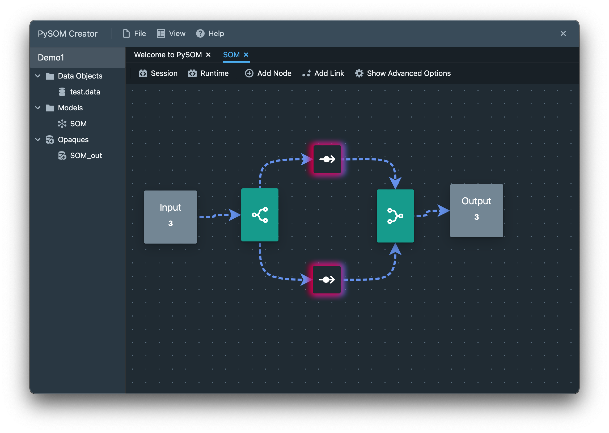
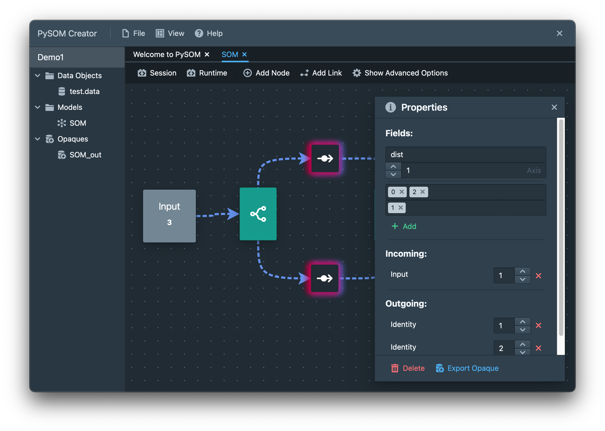
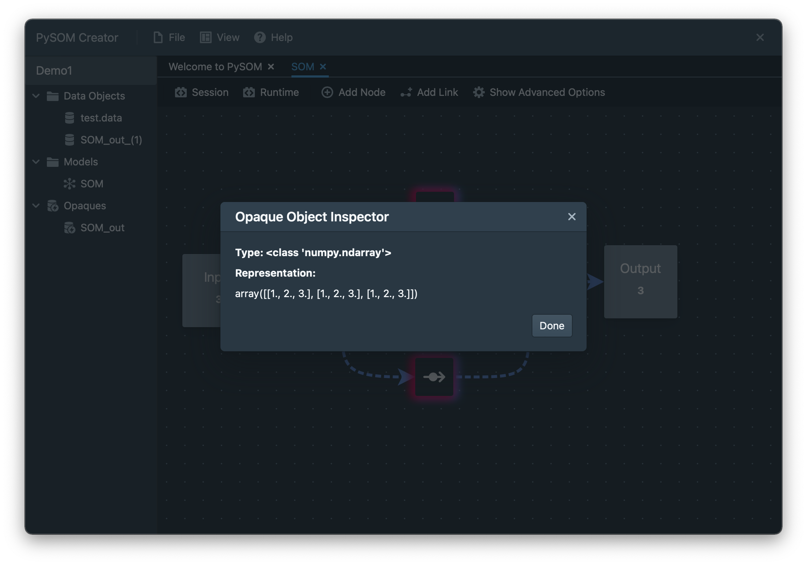

Quickstart
======================

Let's now start building a simple deep SOM graph so we can test that we've 
installed everything and that it is working correctly.

Fire up your favourite text editor or use a Python REPL whichever you prefer and
paste run the following commands.

Essentially, we are building the following graph (shown in ASCII art) below:

.. code-block::
    :caption: The graph to be produced
    
                   *-> node1 ->*
                  /             \
                (1)              \
                /                 \
    input -> dist                 concat -> output
                \                 /
                (0,2)            /
                  \             /
                   *-> node2 ->*

.. code-block:: python
    :caption: A simple graph example built in PySOM Library

    from pysom.node import Node
    from pysom.graph import Graph
    from pysom.nodes.dist import Dist
    from pysom.nodes.concat import Concat
    import numpy as np

    data = [
        [1, 3, 2],
        [1, 3, 2],
        [1, 3, 2]
    ]
    data = np.array(data)

    ### CODE HERE ###

    g = Graph()  # initialise Graph instance

    sel = [(1, [0, 2]), (1, [1])]  # selection(1): dimensions at index 0, 2
    # selection(2): dimensions at index 1

    # create Dist node and provide selections
    dist = g.create(Dist, {'selections': sel})

    g.connect(g.start, dist, 1)  # connect Start node to Distribute node

    node1 = g.create(Node)  # create Default node 1
    node2 = g.create(Node)  # create Default node 2

    # connect Dist node to Default node 1 < sends selection(1) >
    g.connect(dist, node1, 1)
    # connect Dist node to Default node 2 < sends selection(2) >
    g.connect(dist, node2, 2)

    # create Concat node and select axis < axis = 1: concatenates column-wise >
    con = g.create(Concat, {'axis': 1})

    g.connect(node1, con, 1)  # connect Default node 1 to Concat node
    g.connect(node2, con, 1)  # connect Default node 2 to Concat node

    # connect Concat node to End node (Completes the Graph)
    g.connect(con, g.end, 1)

    g.set_input(data)  # set input data

    print(g.get_output())  # get output

You should then see the following output:

.. code-block::

    [[1 2 3]
    [1 2 3]
    [1 2 3]]

Congratulations! You've successfully re-ordered the dimensions of the input
data using a **Distributor** and **Concatenator** node. Next we'll look
at a far more interesting application that will actually use the core **SOM**
node object that trains the data.

But before we do that, if you are interested in using the frontend PySOM
creator application, then we can try to build this same model and get the same
output.

Move into the ``deep-som-dome/app`` directory and run the application with
``npm run start``. Follow the instructions below:

- Click on ``File->Workspace->New`` to create a new Workspace. Give it any name
  you want in the top left corner (defaults to `untitled`).
- Click on ``File->Create->New Model`` to create a new session in the 
  drag-and-drop editor or just use the default one named `SOM`.
- Create a comma separate data file of the input graph, the content of this file 
  (called ``test.data`` as an example) should resemble the following:

.. code-block::
    :caption: Contents of ``test.data``

    [[1 2 3]
    [1 2 3]
    [1 2 3]]

- Upload the data via ``File->Dataset->Import Data`` and select the ``test.data``
  you just made
- Load the data with ``Runtime->Prepare->Select Input``.
- Add the Concatenator, Passthrough and Distributor nodes and then add the 
  links until it resembles the graph below.

- Right click the Distributor node and set the options as follows. Make sure to
  change the slots at the bottom to 1 and 2. Set the axis to 1.

- Change the slots of every other node to 1, except the bottom Passthrough should
  have the incoming as 2 (to match the Distributor).
- ``Compile`` and ``train`` the graph under the ``Runtime`` options.
- Go to ``Runtime->Save Result as->Data``, then right click on the new Data Object
  on the left and inspect it. You should see the output below - great work!

Next we'll look at a more interesting example using an example animal dataset.