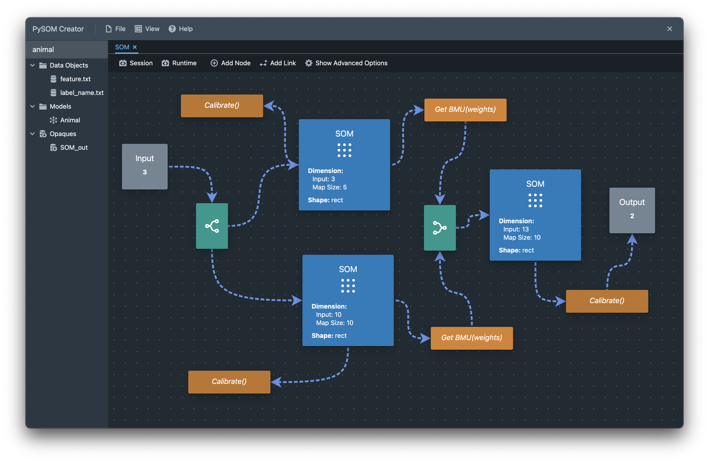

A Harder Example using PySOM Creator
========================================

We will build a more complicated graph using the same animal dataset as
discussed in :doc:`som-lib-adv`, however, the graph produced will be slightly 
different, to demonstrate how to use some of the visualisation tools.

Follow the steps outlined below:

#. Open a new workspace and new model as demonstrated in :doc:`quickstart`.
#. Load in the following animal data files, as provided in the 
   ``deep-som-dome/datasets/animal`` path:

    - ``feature.txt`` - the animal vectors
    - ``label_name.txt`` - the animal labels

#. Set the dimensions of the input node to 13.

#. Add the ``Dist``, ``SOM``, ``BMU``, ``Concat`` and ``Calibrate`` 
   nodes as follows. The graph should resemble the image below. You'll notice
   that there are two ``Calibrate`` nodes that aren't connected to the output,
   and this is intentional.

#. The ``SOM`` nodes after the ``Dist`` nodes should all have the following
   custom parameters, the rest can be default:

    - Input Dimensions: 3 (top), 10 (bottom)
    - Map Size: 5 (top), 10 (bottom)

#. Set the outgoing slots for the ``Dist`` to be 1 and 2, and incoming from
   the input node as 1.

#. Set the outgoing slot of all ``SOM`` to ``Calibrate`` as 0 (we want to pass
   the SOM objet, unlike normal convention). Set the outgoing slot of the 
   ``Calibrate`` to the output node as 0, for similar reasons.

#. Set the outgoing slot of every other non ``Dist`` and non ``Concat`` nodes to be 1.

#. Set the remaining nodes Outgoing slot to be 1.

#. Load the input data with ``feature.txt``, and load all ``Calibrate`` nodes with
   ``label_name.txt``.

#. Compile and train the model.

#. You can extract the results from the following nodes in the property panel.

    - The edge ``Calibrate`` nodes from the two ``SOM`` nodes after the ``Dist``.
      Name the top one ``animal_size`` and the other one ``animal_other`` or similar
    - The output node, name this as ``animal_demo`` or similar

You can now view these outputs in the SOM viewer in ``View->SOM``. To assist you,
a video has been provided below for a demonstration of this entire process, with the
visualisation tool also demonstrated.

.. raw:: html

    <video controls src="_static/demo.mp4"></video> 